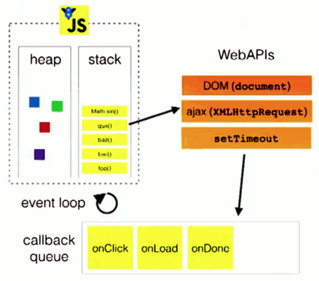

# Question 3)

## Plain JavaScript
#### Explain the differences between Java and JavaScript. You should include both topics related to the fact that Java is a compiled language and JavaScript a scripted language, and general differences in language features
>JavaScript is dynamicly typed, and is a functional scripting/programming language where you can use a function as a parameter. JavaScript is “the” scripting language to use in web development, where as Java is mostly used for backends, and IoT. Java is statically typed.
>Java needs to be compiled(to machine lang in the Virtual Machine), where as JavaScript is text based and does not need compilation.
>Java has block based scoping, where JS har function based scoping.When JVM runs Compile we can get compile time errors, and with Javascript we only have Runtime errors.

#### Explain about the Event Loop in Node.js
>JavaScript is a single threaded language, meaning that originally we could not preform async. requests. Thats where we use a web API, supplied by the V8 engine. This allows us to kick our async. functions over in a C++ code that executes them, and returns them when ready.
>The loop goes as so : 
>Func() enters the Call Stack in JS, if it is a async function, it will be sent to the web API, witch will execute the async code, then it will get sent to the call Queue, where it sits until the CallStack is empty and ready to execute the next task. 

#### Explain and demonstrate how es2015 supports modules (import and export) similar to what is offered by NodeJS.
>The syntax has changed, and we can now deconstruct the imports, `require('')` is node.js specific, and not a part of JS. Now import is native to the js language.
Example : [BabelWebpack](../BabelWebpack/src/index.js) (use project as example)
---
## Express
[Miniproject](https://github.com/Stani2980/miniProjectJS) -  Code example
#### Explain Pros & Cons in using Node.js + Express to implement your Backend compared to a strategy using, for example, Java/JAX-RS/Tomcat
>JavaScript is dynamicly typed, and is a functional scripting/programming language where you can use a function as a parameter. JavaScript is “the” scripting language to use in web development, where as Java is mostly used for backends, and IoT. Java is statically typed.
>Java needs to be compiled(to machine lang in the Virtual Machine), where as JavaScript is text based and does not need compilation.(speeds up development)
> The pros would be the same as above, that you have the entire application in the same language. The scaleability of Node.js + Express is also remarkably easy. And the objects you will be sending back and fourth (JSON),will directly work with JS, but will demand some work before being Java objects. Java/JAX-RS/Tomcat is better for CPU intensive applications, and large enterprise applications. Java also gives you an IDE to work with which include debugging and static type checking (things that can be added to JS via libraries).

#### Explain, using relevant examples, the Express concept; middleware.
> Middlewares, are "functions" that will be run every time our Express backend recieves a HTTP request. These can be used to change the body to JSON, or to check user rights, or you name it... (important that they are in the order you want them executed)

#### Explain, using relevant examples, about testing JavaScript code, relevant packages (Mocha etc.) and how to test asynchronous code.
> We test via using Mocha test library, and Chai assertion library. Then using async/await and using node-fetch library to handle HTTP requests.

#### Explain, using relevant examples, how to implement sessions and the legal implications of doing this.
 > We could use middleware to create/aquire a regular session cookie, which we will send back and fourth. There is also the option to use jwt tokens to handle sessions, if we have a REST api, this would be prefered, because it is not sure that we land at the same server as we did with the previous request(statelessness).
