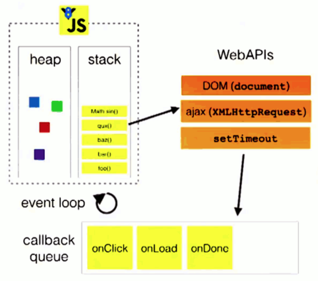

# Question 9)
## Plain JavaScript + Typescript
#### Explain about the Event Loop in Node.js
>JavaScript is a single threaded language, meaning that originally we could not preform async. requests. Thats where we use a web API, supplied by the V8 engine. This allows us to kick our async. functions over in a C++ code that executes them, and returns them when ready.
>The loop goes as so : 
>Func() enters the Call Stack in JS, if it is a async function, it will be sent to the web API, witch will execute the async code, then it will get sent to the call Queue, where it sits until the CallStack is empty and ready to execute the next task. 

#### Explain the two strategies for improving JavaScript: ES6 (es2015) + ES7, versus Typescript. What does it require to use these technologies: In our backend with Node and in (many different) Browsers
>Benefits of TS, are that we have type defenitions, and that prevents some errors and, makes development easier, introducing interfaces like we know them from other languages. Also the ability to make generics.
>ES6+ES7 brings new functionality and *syntactic sugar* to Javascript, making development easier.
>Tough we need to transpile the code to older Javascript versions as browsers do not comprehend ES5 and up. (IE used at companies)
>JavaScript versions are way ahead of the versions that are supported in the browsers. But for the comfort of developers, and to use the new features of ES6+ES7, we can write these in development, then we can transpile the code to an elder version of JS(ES5), so that the elder browsers can run our code as well.
>Typescript is a superset of JS, that "lays on top" of ES6 and adds even more features, as stricter types, and interfaces, and as with Babel we can use Typescript to transpile the codebase into ES5, once again making it runnable in elderly browsers(IE).

Example (Typescript) [ts.ts](../ts.ts)
Example (ES7) : [BabelWebpack](../BabelWebpack/src/index.js) (use project as example)

#### Provide examples with es6, running in a browser, using Babel and Webpack
Example : [BabelWebpack](../BabelWebpack/src/index.js) (use project as example)

## NoSQL, MongoDB and Mongoose
[Miniproject](https://github.com/Stani2980/miniProjectJS) -  Code example for all below
#### Explain Pros & Cons in using a NoSQL database like MongoDB as your data store, compared to a traditional Relational SQL Database like MySQL.
> The performance of such databases can be much faster, because the database does not handle joins, as a traditional database does, which are very time consuming. Though you have to query multiple times to get "foreign keys", but this can also be fixed by embedding, then you will only query one document and get all the info you need. These types of databases are also really good at handling modern features as location markers, and much greater scaleability.
> A con would be that it is not suitet for critical applications, like bank transfers or equally important data transfers. They are not capable of **ACID(Atomicity, Consistency, Isolation, Durability)** is a set of properties of database transactions intended to guarantee validity even in the event of errors, power failures, etc.
>**Instead it offers Eventual Consistency**
>Informally guarantees that, if no new updates are made to a given data item, eventually all accesses to that item will return the last updated value.

#### Explain reasons to add a layer like Mongoose, on top on of a schema-less database like MongoDB
> The mongoose layer (ODM Object Document Mapper), gives us a type of "classical" schema, wich gives us some guidance in the code what an entity is built of. Mongoose also brings strongly typed variables, so the data that we get and add to the database is consistent. It also allows us to query the database with object like structure. (very similar to JPQL in essence)

#### Explain the “6 Rules of Thumb: Your Guide Through the Rainbow” as to how and when you would use normalization vs. denormalization.
- *Favor embedding unless there is a compelling reason not to*
    >Faster
- *The need to access an object on its own, is a compelling reason not to embed it*
    >Self explainatory
- *Arrays should not grow without bound. If there are more than a couple of hundred documents on the “many” side, don’t embed them; if there are more than a few thousand documents on the “many” side, don’t use an array of ObjectID references. High-cardinality arrays are a compelling reason not to embed.*
    >Too much repeated data.
- *Don’t be afraid of application-level joins: if you index correctly and use the projection specier (as shown in part 2) then application-level joins are barely more expensive than server-side joins in a relational database.*
    >So rather fetch twice, because the fetching is much faster from documents, and let the client use CPU power to join the data to objects.
- *Consider the write/read ratio when denormalizing. A field that will mostly be read and only seldom updated is a good candidate for denormalization*
    >If you wont update the data often, then embed it. (this makes updating a bit more difficult if more than one user uses the data)
- *How you eventaully model your data depends – entirely – on your particular application’s data access patterns.*
    >Create documents by business requirements, as these can be very specific, and NoSQL allows you to create documents as you like :).

#### Explain, using a relevant example, a full JavaScript backend including relevant test cases to test the REST-API (not on the production database)
[Miniproject](https://github.com/Stani2980/miniProjectJS) -  Code example